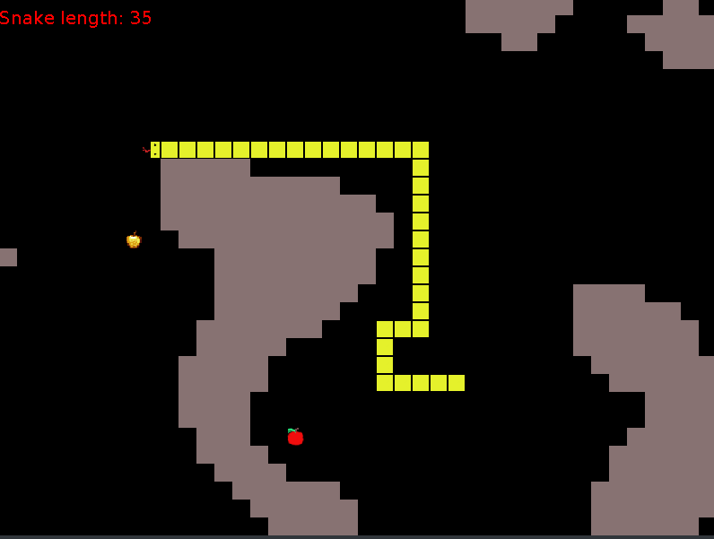

## General info
This project was made for an OOP class. Popular snake game with additional walls.
	
## Technologies
Project is created with:
* Java 11.0.4
* Json-simple 1.1.1

## Setup
To run this project, compile and run class src/agh/cs/project2/gui/SnakeGame.java

## Settings
Simple settings are in the file src/parameters.json:
* width - board width
* height - board height
* scale - size of the window
* periodInterval - time between frames

## Snake control

You have to press the arrow keys to change the direction of the snake. The snake is moving forward automatically.
You can also speed up holding shift.

